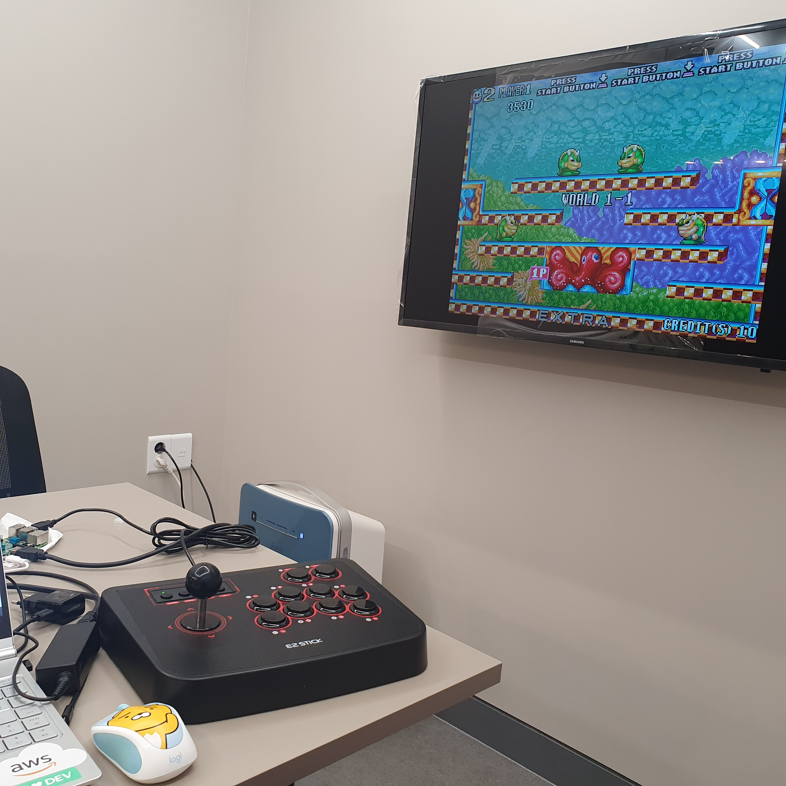
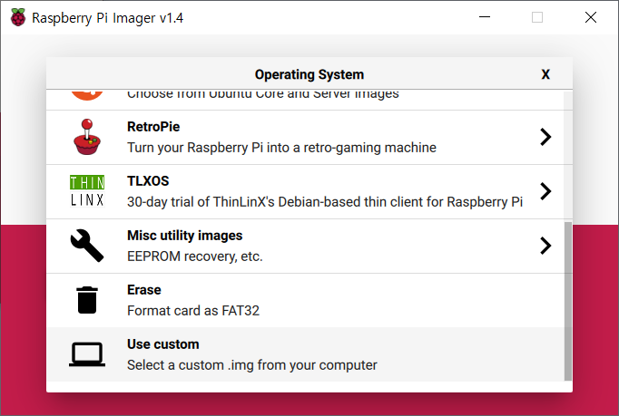

# Haedal_Oraksil_Project

  
~~동성로 해달을 오락실로 만들어보자 모두모두 와서 게임하라구~~

## 준비물

+ 라즈베리파이(3도 괜찮고 4도 괜찮다! 다만 4는 조금 다를 수 있음)
+ 전원선(2.5A 권장)
+ microSD카드(최소 16GB, 클수록 게임을 더 많이 담을 수 있겠죠?)
+ microSD카드 - usb 변환 젠더(없다면.. 다이소에서도 살 수 있음, 혹은 라즈베리파이 살 때 주기도 함)
+ PC 혹은 노트북
+ 키보드, 마우스(없어도 되..긴 하는데 없으면 정말정말 불편할 수 있음)

## 그럼 시작해볼까?

### 라즈베리파이에 OS 설치하기

우선 OS 설치를 어떻게 하느냐! 본인은 [RaspberryPi Imager](https://www.raspberrypi.org/downloads/)를 활용하였는데, 눌러서 들어가보면 각자의 OS에 맞게 받을 수 있다.  

  

본인은 윈도를 사용하기 땜시롱 윈도를 받았지! 그리고 microSD카드를 그.. 변환 젠더에 끼운 다음에 pc에 연결한 후에 imager를 이용하여 microSD카드에 부팅 이미지를 구우면 되는데(윈도우 부팅usb 만드는 것과 매우 유사함),  대개 보통은 네이버 카페 [라즈겜동](https://cafe.naver.com/raspigamer)이나, [RetroPie](https://retropie.org.uk/)의 롬을 사용할 확률이 높다. 본인도 라즈겜동 한방팩을 받아 설치하였다(롬을 보면 근본은 라즈비안인데 거기에서 이것저것 뜯어고친 것 같음..아마도). 해서 마음에 드는 OS 이미지를 받아서 컴퓨터에 잘 저장해 두도록 하자.


​	CHOOSE OS 클릭



Use custom 클릭 후 설치할 OS를 선택하고, CHOOSE SD CARD를 눌러서 설치할 SD카드를 선택한다. 그 후 WRITE를 누르면 OS 설치는 완료되게 된다!

### ROM파일 넣기

OS 설치가 완료되었다면, 이제 라즈베리파이에 ROM 파일을 넣어야 하는데, 이게 여간 귀찮은 일이 아니다. microSD카드에 직접 롬파일을 넣는 방법도 있다고 하던데, 본인이 여러번 시도해보았음에도 불구하고 방법을 찾지 못했기 때문에 같은 네트워크망에 연결 후(같은 와이파이에 연결한다는 뜻) ip를 알아내서 알ftp 등 프로그램을 이용해서 파일을 전송하는 법에 대해 서술할 예정이다. 
그런데 여기서 또 약간의 문제가 발생하는데, 해달 와이파이(`Haedal Programming`)의 경우 단말기 간 통신을 허용하지 않는 방식이기 때문에 내가 같은 네트워크에 연결 후 ip를 알아내도 라즈베리파이와 노트북(혹은 PC)을 연결할 수 없다. 해서 해달에서 단말기 간 연결을 시도할 경우에는 `haedal1` 와이파이를 이용할 수 있도록 하자. 비밀번호는 알 것 같은 사람들한테 물어보면 될 것이다..아마도

사용자의 노트북을 `haedal1` 와이파이에 연결하는 것은 아주 쉬운 일이다. 비밀번호만 알고 있다면 말이지.. 문제는 라즈베리파이를 `haedal1` 와이파이에 연결하는 것인데, 사실 마우스와 키보드만 있다면(RetroPie 혹은 라즈겜동 한방팩인 경우 키보드만.. 있어도 원활할 것이다.) 설정에 들어가서 다음과 같이 설정해 주도록 하자.

> 대충 라즈베리파이에서 wifi 설정하는 방법

이제 라즈베리파이의 ip를 알아내야 하는데, 이 때 윈도우 cmd 명령어로 간단하게 같은 네트워크 상의 단말기 ip를 알아낼 수가 있다. Window키+R을 누른 후 cmd를 누른 후 Ctrl+Shift+Enter 를 치면 cmd를 관리자 권한으로 실행할 수 있다. 여기서

```
arp -a
```

를 치면 뭐가 주루룩 나오는데, 이 방법은 MAC 주소를 정확하게 알고 있다면 간단하게 알아볼 수 있겠지만 그럴 확률은 꽤 낮다. 물론 미리 알고 있다거나, 아니면 `haedal1` 와이파이에 연결된 단말기가 많지 않은 현재(2020년 8월 11일 기준)로

가장 중요한 것은, 옳은 에뮬레이터 안에 옳은 롬파일을 넣어야 한다는 것이다! 본인도 처음에 매우매우 고생함